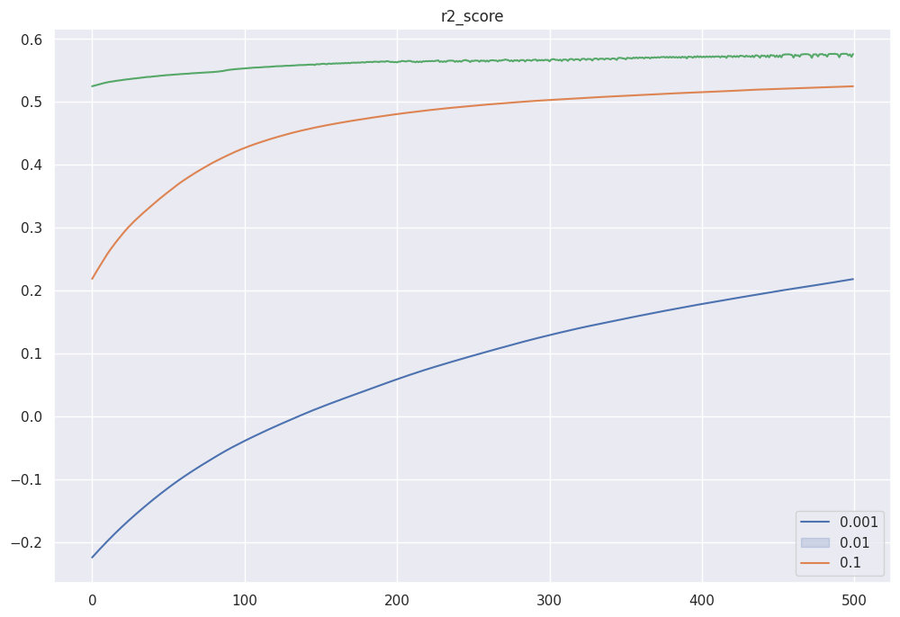
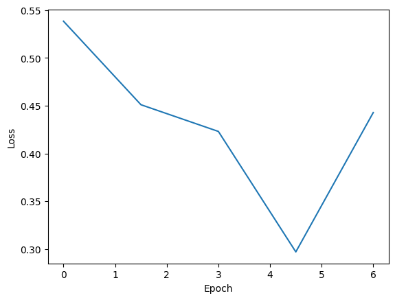
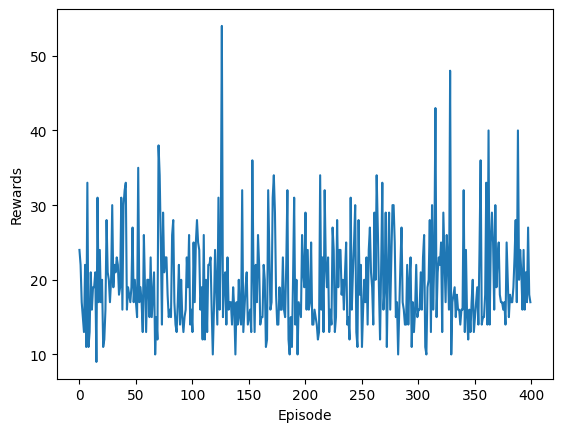
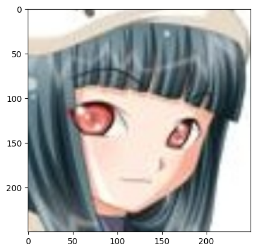

# Deep Learning Course Labs

## 1. Forward Pass

Лабораторная по внутренней механике нейронной сети:

- создание полносвязных преобразований;
- применение функций активации;
- softmax для многоклассового выхода;
- вычисление функции потерь;
- проверка операций на PyTorch tensors.

## 2. Инициализация, оптимизация и регуляризация

Лабораторная посвящена устойчивому обучению нейронных сетей:

- Xavier initialization;
- Kaiming initialization;
- SGD;
- RMSprop;
- Adam;
- Dropout;
- Batch Normalization;
- анализ различий между train/test поведением.



## 3. Transfer Learning для классификации изображений

Работа с pretrained CNN:

- загрузка изображений через `ImageFolder`;
- подготовка `DataLoader`;
- использование `VGG16`;
- заморозка и настройка параметров;
- fine-tuning;
- отслеживание loss и accuracy на train/test.



## 4. Policy Gradients

Deep Reinforcement Learning на среде `CartPole`:

- нейронная сеть задаёт policy;
- действия семплируются из распределения вероятностей;
- сохраняются log-probabilities;
- рассчитывается discounted return;
- policy обновляется по собранным эпизодам;
- анализируется динамика reward.



## 5. GAN

Лабораторная по генеративно-состязательным сетям:

- отдельные сети `Generator` и `Discriminator`;
- сверточные слои;
- `ConvTranspose2d` для генератора;
- обучение на наборе изображений;
- визуализация генерируемых примеров.



## Структура

```text
deep-learning-labs/
├── README.md
├── requirements.txt
├── .gitignore
├── assets/
└── notebooks/
    ├── 01_forward_pass.ipynb
    ├── 02_training_regularization.ipynb
    ├── 03_transfer_learning_cnn.ipynb
    ├── 04_policy_gradients.ipynb
    └── 05_gan.ipynb
```

## Стек

`Python` · `PyTorch` · `torchvision` · `NumPy` · `pandas` · `scikit-learn` · `Matplotlib` · `Gymnasium`
